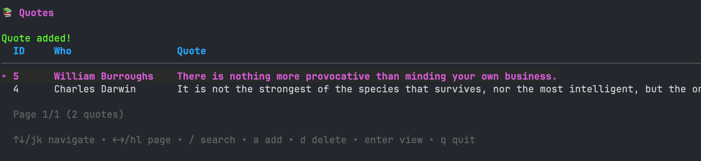

# quotes

I used to keep quotes in MacOS sticky notes.  It was not the best experience.

## What it does

Two modes. Run `quotes` with no arguments and you get a TUI for browsing, searching, and adding new quotes. Run `quotes darwin` or `quotes some famous words` and it'll just print out any matches on the 'who' or 'quote' fields.

The database lives at `~/.quotes/quotes.db` and gets created on first run.



## Installation

### Pre-built binaries

Grab the latest binary for your platform from the [releases page](https://github.com/ohnotnow/quotes/releases). Download it, make it executable, and put it somewhere on your `$PATH`:

```bash
chmod +x quotes-darwin-arm64
mv quotes-darwin-arm64 /usr/local/bin/quotes
```

### Building from source

Requires Go 1.25+.

```bash
git clone https://github.com/ohnotnow/quotes.git
cd quotes
go build -o quotes .
```

## Usage

### TUI mode

```bash
quotes
```

| Key | Action |
|-----|--------|
| `j` / `k` or arrow keys | Navigate the list |
| `h` / `l` or arrow keys | Previous / next page |
| `/` | Search |
| `a` | Add a new quote |
| `d` | Delete selected quote (with confirmation) |
| `enter` | View the full quote |
| `q` | Quit |

### Quick search

```bash
quotes darwin
quotes species that survives
quotes "responsive to change"
```

## Running tests

```bash
go test ./...
```

## Contributing

Fork it, make your changes, run `go build .` to check it compiles, open a PR.

## Licence

[MIT](LICENSE)
